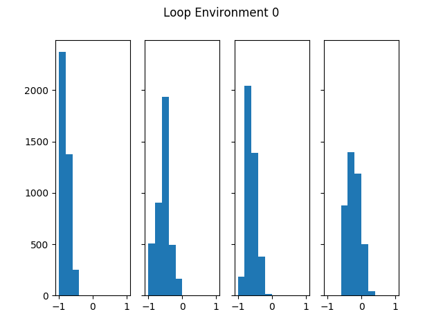

# Bayesian Inverse Reinforcemen Learning

Paper URL: https://www.aaai.org/Papers/IJCAI/2007/IJCAI07-416.pdf

Enviornment is the figure1 in the [birl paper](https://www.aaai.org/Papers/IJCAI/2007/IJCAI07-416.pdf)

# Tested on  
python==3.7.0  
numpy==1.15.1  
scipy==1.1.0  
tqdm==4.26.0  
matplotlib==2.2.3  

# Run Experiments

```sh
python src/birl.py
```

# Results
Sampled rewards for each states.   
An optimal policy for mean of sampled rewards were exactly matched with the expert's policy.


